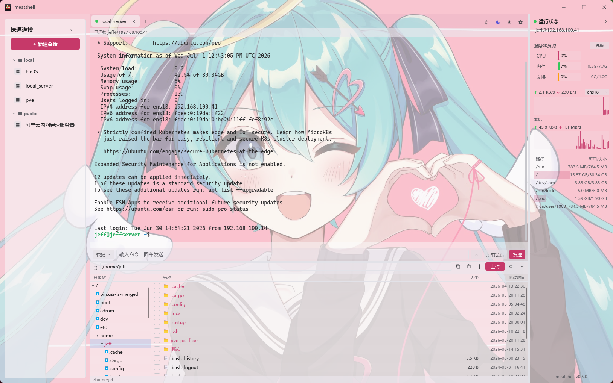
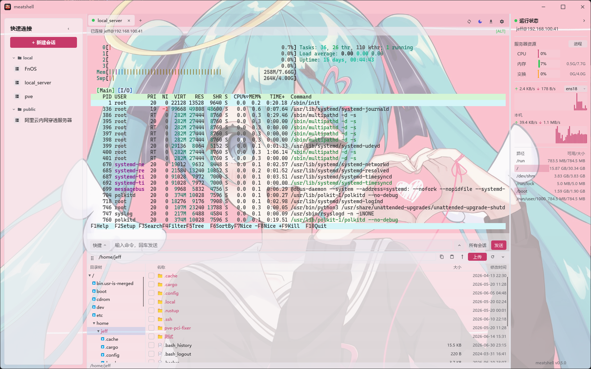

# meatshell

**简体中文** | [English](./README.en.md)

一个轻量级、低内存占用的 SSH / 终端客户端，灵感来自 FinalShell，但完全由
**Rust + [Slint](https://slint.dev)** 实现。目标是保留 FinalShell 的核心体验
（资源监控侧栏、会话管理、多标签页终端）的同时，把内存占用从 400 MB+ 的
JVM 压到几十 MB 原生级别。

> 本项目 fork 自 [yituorou/meatshell](https://github.com/yituorou/meatshell)。
> 主要技术栈变更：终端模拟引擎从 `vt100` 迁移至 `alacritty_terminal` 0.26，
> 新增 Scrollback 修复、SFTP 遮挡修复、Storage scrollback 方案等多项架构优化。

## 截图

<p align="center">
  <br>
  <em>欢迎页：会话管理 + 左侧本机资源监控</em>
</p>

<p align="center">
  <br>
  <em>多标签页终端（htop 全屏渲染）+ 底部 SFTP 文件浏览 + 远端资源监控</em>
</p>

## 下载与安装

每次打 `v*` 标签，GitHub Actions 会自动构建 **Windows / Linux / macOS** 三平台二进制，
发布到 [Releases](https://github.com/jeff141/meatshell/releases) 页面。

### Windows

下载 `meatshell-*-windows-x86_64.zip`，解压后双击 `meatshell.exe`。

### Linux

```bash
tar -xzf meatshell-*-linux-x86_64.tar.gz
cd meatshell-*-linux-x86_64
./meatshell                                  # 直接运行
# 可选：装应用图标 + 启动器入口（Dock / 应用列表里显示图标，无需传参）
chmod +x install-linux.sh && ./install-linux.sh
```

> 需要 glibc ≥ 2.35（Ubuntu 22.04+ / Debian 12+）。Wayland 下首次装完图标可能要注销重登一次。

从源码 `cargo run`（Linux Mint / Ubuntu / Debian）需要先安装 Slint/winit/rfd 等用到的系统开发包：

```bash
sudo apt update
sudo apt install -y --no-install-recommends \
  build-essential pkg-config cmake \
  libfontconfig1-dev libfreetype6-dev \
  libxcb1-dev libxcb-render0-dev libxcb-shape0-dev libxcb-xfixes0-dev \
  libxkbcommon-dev libxkbcommon-x11-dev libwayland-dev \
  libgl1-mesa-dev libegl1-mesa-dev libgtk-3-dev \
  libudev-dev
```

### macOS

下载得到的是 `.zip`，里面是 `meatshell.app` 应用程序包：

```bash
# 解压(aarch64 = Apple 芯片，x86_64 = Intel)
unzip meatshell-*-macos-*.zip
# 移到「应用程序」(可选，留在原地也行)
mv meatshell.app /Applications/
# 去掉「未签名应用」的隔离属性，否则会提示「meatshell 已损坏，无法打开」
xattr -dr com.apple.quarantine /Applications/meatshell.app
# 打开(或在「访达」里双击)
open /Applications/meatshell.app
```

> 若未移到 `/Applications`，把上面两条路径换成 `.app` 实际所在位置(如 `~/Downloads/meatshell.app`)即可。

> 从源码构建见下方 [运行](#运行)。

## 功能

### 已实现

- [x] FinalShell 风格 UI，深色 / 浅色 / 跟随系统主题
- [x] 本机 + 远端资源监控（CPU / 内存 / 交换 / 网络 / 磁盘）
- [x] 远端进程监控（按 CPU 排序、PID 复制与权限确认后结束进程）
- [x] 完整 VT/ANSI 终端模拟（btop / htop / vim 全屏正常渲染）
- [x] 彩色 emoji（支持肤色、旗帜及 ZWJ 组合序列）
- [x] 多标签页（欢迎页 + 多个会话）
- [x] 会话管理：新建 / 编辑 / 删除 / 分组，本地 JSON 持久化，导出 / 导入
  - 配置位置：`%APPDATA%/meatshell/sessions.json`（Windows）
    / `~/.config/meatshell/sessions.json`（Linux）
    / `~/Library/Application Support/meatshell/sessions.json`（macOS）
- [x] SSH（`russh`，纯 Rust）：密码 / 私钥 / 加密私钥（密码短语）
- [x] SFTP 文件浏览 + 上传 / 下载（拖拽）+ 终端内 ZMODEM（`sz`）接收
- [x] SSH 端口转发 / 隧道：本地 -L / 远程 -R / 动态 -D（SOCKS5）
- [x] 快捷命令 + 命令输入框（可群发到所有会话）+ 命令历史
- [x] 串口 / Telnet 会话
- [x] 出站代理（SOCKS5 / HTTP）
- [x] 导入 `~/.ssh/config`
- [x] 会话密码加密存储（ChaCha20-Poly1305）
- [x] 已知主机（`known_hosts`）校验 + 首次连接确认
- [x] 多标签页终端分屏

彩色 emoji 图形来自 [Twemoji](https://github.com/jdecked/twemoji)，按
[CC BY 4.0](https://creativecommons.org/licenses/by/4.0/) 使用；完整署名见
[THIRD_PARTY_NOTICES.md](THIRD_PARTY_NOTICES.md)。

### 计划中

- [ ] 会话密码改用 OS 钥匙串存储

## 技术栈

| 模块          | 选型                                                              |
| ------------- | ----------------------------------------------------------------- |
| UI            | [Slint](https://slint.dev) 1.8（纯 Rust 编译，无 GC）            |
| 终端模拟      | [`alacritty_terminal`](https://crates.io/crates/alacritty_terminal) 0.26（VT/ANSI + 原生 scrollback/reflow） |
| PTY           | `portable-pty` 0.8（跨平台伪终端）                                |
| 异步运行时    | [`tokio`](https://tokio.rs) 1.x（rt-multi-thread）                |
| SSH 协议      | [`russh`](https://crates.io/crates/russh) 0.49（纯 Rust，无 libssh） |
| SFTP          | `russh-sftp` 2                                                     |
| 系统指标      | [`sysinfo`](https://crates.io/crates/sysinfo) 0.33                 |
| 序列化        | `serde` + `serde_json`                                             |
| 日志          | `tracing` + `tracing-subscriber`                                   |
| 密码加密      | `chacha20poly1305`（会话密码）+ `aes`/`argon2`/`hmac`/`sha2`（PuTTY PPK） |
| 表情符号      | `twemoji-assets` 1.5（内嵌 PNG）                                   |
| 代理          | `tokio-socks` 5（SOCKS5）                                          |
| 串口          | `serialport` 4                                                     |
| 系统字体      | `fontdb` 0.16                                                     |
| 图像解码      | `image` 0.25（PNG/JPEG/WebP/BMP 壁纸）                             |
| 更新检查      | `ureq` 2（HTTPS，后台线程）                                        |

## 运行

```bash
cargo run --release
```

首次启动会在 `%APPDATA%/meatshell/sessions.json` 建立空的会话库。点击右上
角 **“＋ 新建会话”** 添加第一台服务器。

## 项目布局

```
meatshell/
├── Cargo.toml
├── build.rs                     # Slint 编译器入口
├── ui/                          # Slint 界面定义
│   ├── app.slint                # 顶层窗口
│   ├── terminal_view.slint      # 终端视图 + SFTP dock
│   ├── sftp_panel.slint         # SFTP 文件浏览面板
│   ├── sidebar.slint            # 左侧系统监控面板
│   ├── tabs.slint               # 顶部标签栏
│   ├── welcome.slint            # 欢迎页 / 快速连接
│   ├── session_dialog.slint     # 新建 / 编辑会话弹框
│   ├── interface_panel.slint    # 界面设置面板
│   ├── proc_window.slint        # 进程管理窗口
│   ├── system_info_window.slint # 系统信息窗口
│   ├── confirm_dialog.slint     # 确认 / 删除对话框
│   ├── theme.slint              # 设计 tokens（深色/浅色）
│   ├── widgets.slint            # 可复用组件
│   └── fonts/                   # 内嵌字体
├── lang/                        # 国际化
│   ├── zh/                      # 简体中文
│   └── en/                      # English
└── src/
    ├── main.rs                  # 入口
    ├── app.rs                   # UI ↔ 后端桥接（核心控制器）
    ├── terminal/                # 终端模拟子系统
    │   └── impls/
    │       ├── vt_adapter.rs    # alacritty_terminal 封装
    │       ├── term_buffer.rs   # 终端缓冲区（scrollback/渲染/缓存）
    │       ├── render.rs        # 行构建（build_row/build_line）
    │       ├── presentation.rs  # 终端输出渲染 + emoji
    │       ├── input.rs         # 键盘输入编码（PTY/IME/Ctrl）
    │       ├── local.rs         # 本地 shell（portable-pty）
    │       ├── serial.rs        # 串口终端
    │       ├── telnet.rs        # Telnet
    │       ├── zmodem.rs        # ZMODEM 文件传输
    │       ├── render_gate.rs   # 帧同步栅栏
    │       └── output_highlight.rs  # 日志/DevOps 级别着色
    ├── ssh/                     # SSH 子系统
    │   └── impls/
    │       ├── ssh.rs           # SSH 会话 worker
    │       ├── known_hosts.rs   # 主机密钥校验
    │       ├── ppk.rs           # PuTTY PPK 私钥加载
    │       ├── proxy.rs         # 出站代理（SOCKS5）
    │       └── ssh_config.rs    # ~/.ssh/config 导入
    ├── sftp/                    # SFTP 文件浏览 + 上传/下载
    ├── session/                 # 会话管理（JSON 持久化、加密存储）
    ├── tunnel/                  # SSH 端口转发（-L/-R/-D）
    ├── resource/                # 系统资源监控（CPU/内存/交换/磁盘/网络）
    ├── config/                  # 配置管理
    ├── i18n/                    # 国际化
    ├── layout/                  # 窗口布局 / 分屏
    ├── logging/                 # tracing 初始化
    ├── ui/                      # Slint UI 辅助类型（TermSpan/Match）
    ├── wallpaper/               # 自定义背景图
    └── webdav/                  # WebDAV 客户端
```

## 开发提示

- Slint 控件有非常严格的布局 DSL，改 `.slint` 后 `cargo check` 是最快的
  反馈方式。
- 应用事件循环是单线程（Slint 要求），所有跨线程 UI 更新通过
  `slint::invoke_from_event_loop` 回调。
- SSH / SFTP 共享 `known_hosts` 校验逻辑：首次连接会确认并记住主机密钥，
  后续密钥变化会再次提示。

## 发版

不要直接手动修改 `Cargo.toml` 后再打标签。使用发布脚本，让 Git tag 指向的提交本身就已经包含正确版本号：

```powershell
.\scripts\release.ps1 v0.6.0 -Push
```

脚本会更新 `Cargo.toml` / `Cargo.lock`，运行 `cargo check --locked`，验证 `meatshell --version`，提交 `Release v0.6.0`，创建 annotated tag，并推送当前分支和 tag。更多细节见 [docs/release.md](docs/release.md)。

## License

MIT OR Apache-2.0（双许可）。
